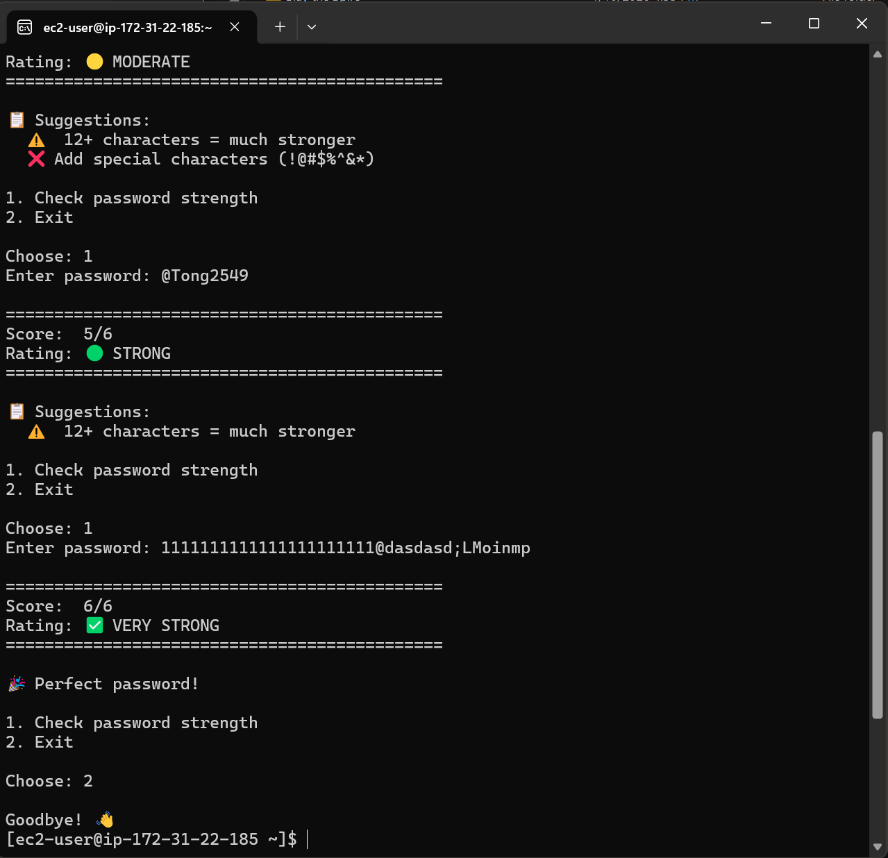

# 🔐 Project #6 — Password Strength Checker

**Author:** Kanthi Phoosorn  
**Date:** March 10, 2026  
**Part of:** [Cloud-Security-Engineer Portfolio](https://github.com/KanthiPhoosorn/Cloud-Security-Engineer)

## 📋 What I Did
- Built password strength checker in Python
- Checks length, uppercase, lowercase, numbers, special chars
- Detects common weak passwords
- Runs on AWS EC2

## 🛠️ Technologies Used
- Python 3
- Regex (re module)
- AWS EC2

## 🚀 How to Run
```bash
python3 password_checker.py
```

## 📊 Rating System
| Score | Rating |
|---|---|
| 0–2 | 🔴 WEAK |
| 3–4 | 🟡 MODERATE |
| 5 | 🟢 STRONG |
| 6 | ✅ VERY STRONG |

## 📸 Screenshot

